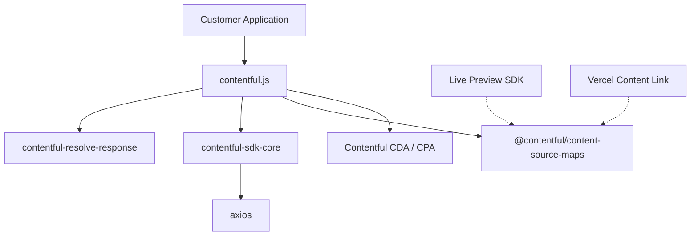

# Architecture

## Overview

contentful.js is a typed JavaScript/TypeScript client for the Contentful Content Delivery API (CDA) and Content Preview API (CPA). It provides a high-level interface over HTTP that handles link resolution, response normalization, sync orchestration, Content Source Maps, and cursor-based pagination.

## System Context



## Internal Structure

```
lib/
├── index.ts                  Public exports
├── contentful.ts             createClient() — entry point, client configuration
├── make-client.ts            Assembles the ContentfulClientApi from mixins
├── create-contentful-api.ts  Wires HTTP methods to API endpoints
├── create-global-options.ts  Space/environment URL configuration
├── paged-sync.ts             Sync API orchestration (initial + incremental)
├── global.d.ts               Global type declarations (__VERSION__)
├── mixins/
│   └── stringify-safe.ts     Safe JSON serialization for circular references
├── types/
│   ├── index.ts              Re-exports all public types
│   ├── client.ts             ContentfulClientApi interface
│   ├── entry.ts              Entry types with generic content type support
│   ├── asset.ts              Asset types
│   ├── content-type.ts       Content type definitions
│   ├── collection.ts         Paginated collection types
│   ├── sync.ts               Sync response types
│   ├── query/                Query parameter types (filtering, ordering, etc.)
│   └── ...                   Other entity types (locale, tag, concept, etc.)
└── utils/
    ├── normalize-select.ts              Ensures sys fields in select queries
    ├── normalize-search-parameters.ts   Query parameter normalization
    ├── normalize-cursor-pagination-*.ts Cursor pagination helpers
    ├── resolve-circular.ts              Circular reference resolution
    ├── validate-params.ts               Client parameter validation
    ├── validate-search-parameters.ts    Search query validation
    └── ...                              Other utilities
```

## Build Pipeline

The SDK produces three output formats from a single TypeScript source:

```
lib/**/*.ts
    │
    ├── tsc ──────────► dist/esm-raw/    (intermediate, not shipped)
    │                       │
    │                       ├── Rollup (ESM) ──► dist/esm/          (preserveModules)
    │                       ├── Rollup (CJS) ──► dist/contentful.cjs
    │                       ├── Rollup (Browser) ──► dist/contentful.browser.js
    │                       └── Rollup (Browser min) ──► dist/contentful.browser.min.js
    │
    └── tsc (declarations) ──► dist/types/   (.d.ts files)
```

**Package exports:**
- `import` → `dist/esm/index.js` (tree-shakeable ESM)
- `require` → `dist/contentful.cjs` (CJS bundle)
- `types` → `dist/types/index.d.ts`

## Data Flow

### Standard Query

```
createClient({ space, accessToken })
    → createHttpClient(axios, config)     [contentful-sdk-core]
    → makeClient({ http, getGlobalOptions })
    → client.getEntries(query)
        → normalizeSearchParameters(query)
        → HTTP GET /entries?...
        → resolveResponse(response)       [contentful-resolve-response]
        → return typed Collection<Entry>
```

### Content Source Maps (Preview only)

```
createClient({ ..., includeContentSourceMaps: true })
    → adds includeContentSourceMaps=true to all CPA requests
    → response includes CSM metadata
    → @contentful/content-source-maps decorates string values with hidden metadata
    → Live Preview SDK / Vercel reads the metadata for field-to-entry mapping
```

### Sync API

```
client.sync({ initial: true })
    → GET /sync?initial=true
    → paged-sync.ts extracts sync_token from nextPageUrl/nextSyncUrl and paginates until complete
    → returns { entries, assets, deletedEntries, deletedAssets, nextSyncToken }

client.sync({ nextSyncToken })
    → GET /sync?sync_token=...
    → returns incremental delta
```

## Key Dependencies

| Dependency | Why it's here |
|---|---|
| `axios` | Shared HTTP client across JS SDK family; consistent Node+browser abstraction; interceptor support (see ADR) |
| `contentful-sdk-core` | Shared foundation: HTTP client creation, rate limiting, error handling, user-agent headers |
| `contentful-resolve-response` | Link resolution — resolves `Link` objects to their full entry/asset representations |
| `@contentful/content-source-maps` | Encodes/decodes Content Source Maps metadata for visual editing integrations |
| `@contentful/rich-text-types` | Type definitions for Rich Text fields |
| `tslib` | TypeScript helper runtime (importHelpers: true) to reduce bundle size |
| `type-fest` | Utility types for advanced TypeScript generics |
| `json-stringify-safe` | Safe serialization handling circular references in resolved responses |

## Configuration

| Parameter | Purpose | Default |
|---|---|---|
| `space` | Contentful space ID | (required) |
| `accessToken` | CDA or CPA access token | (required) |
| `environment` | Environment ID | `"master"` |
| `host` | API hostname | `"cdn.contentful.com"` |
| `includeContentSourceMaps` | Enable Content Source Maps (CPA only) | `false` |
| `timelinePreview` | Enable Timeline Preview (CPA only) | `undefined` |
| `retryOnError` | Retry on 429/5xx | `true` |
| `retryLimit` | Max retry attempts | `5` |
| `timeout` | Connection timeout (ms) | `30000` |

## Integration Points

### Upstream (this repo consumes)

- **Contentful CDA** (`cdn.contentful.com`) — production content delivery
- **Contentful CPA** (`preview.contentful.com`) — draft/preview content
- **contentful-sdk-core** — HTTP client factory, shared behaviors
- **contentful-resolve-response** — link resolution algorithm

### Downstream (consumes this repo)

- **Customer applications** — Node.js servers, SPAs, SSR frameworks
- **Framework integrations** — Next.js, Gatsby, Nuxt contentful plugins
- **Live Preview SDK** — consumes Content Source Maps for visual editing
- **Vercel Content Link** — consumes Content Source Maps for in-page editing indicators

## Operational Knowledge

<!-- Generated by seed-golden-context | Last updated: 2026-05-04 -->

### Deployment

This is an npm package — "deployment" means publishing a new version to the npm registry. The process is fully automated:

1. Merge to `master` with a conventional commit (`feat:`, `fix:`, `build(deps):`, etc.)
2. CI runs the full build + test suite
3. `semantic-release` determines version bump from commit history, publishes to npm, creates a GitHub release, and updates `CHANGELOG.md`
4. TypeDoc API documentation is published automatically post-release

**Rollback:** npm does not support true rollback. If a bad version is published:
- `npm deprecate contentful@<version> "reason"` to warn consumers away from the broken version
- Publish a follow-up patch (`fix:` commit) as the corrective release
- For critical regressions: coordinate with the DX team on whether to unpublish (only viable within 72h of publish and if the version has low adoption)

**Pre-releases:** Published from the `next` branch when active. Consumers opt in via `npm install contentful@next`.

### Failure Modes

| Failure | Symptom | What to do |
|---|---|---|
| CDA/CPA unreachable | All requests throw `ContentfulError` with network error or timeout | SDK retries on 429/5xx up to 5 times with backoff (via `contentful-sdk-core`). If persistent, check Contentful status page. Not fixable in the SDK. |
| Rate limiting (429) | Requests fail after burst | SDK auto-retries with backoff. If retries exhaust, consumer sees error. Advise consumers to reduce request frequency or use sync API for bulk reads. |
| Bundle size regression | `test-bundle-size` CI job fails | Check what was added with `npm run test:size` locally. `size-limit` limits: 85KB browser / 45KB min. Use `rollup-plugin-visualizer` to identify the culprit. |
| Type regression | `test:types` fails | `tsd` tests in `test/types/` are the only gate for type correctness. Vitest does not catch type errors. Run `npm run test:types` locally. |
| ES target violation | `check` CI job fails | `es-check` found syntax above ES2017 (CJS/ESM) or ES2018 (browser bundles). Usually caused by a dependency or a new TS/Rollup feature. Check Rollup output and Babel config. |
| Link resolution broken | Linked entries not resolved in responses | Link resolution is handled by `contentful-resolve-response`, not this repo. File an issue there. |
| CSM not working | Content Source Maps metadata absent | CSM only works with CPA (`host: 'preview.contentful.com'`). Verify `includeContentSourceMaps: true` and that the correct host is set. |

### Monitoring

This is a client-side library — there is no server-side infrastructure to monitor. Consumer-facing signals:

- **npm download stats** — [npmjs.com/package/contentful](https://www.npmjs.com/package/contentful) — tracks adoption and version uptake
- **GitHub Issues** — primary signal for consumer-reported bugs and regressions
- **Dependabot alerts** — GitHub security tab on this repo; high/critical alerts should be addressed promptly
- **CI status** — all merges to `master` and `next` run the full pipeline; a failing release job is the closest equivalent to a prod incident
- **Datadog** — internal dashboards for SDK error rates and API call volumes from contentful.js consumers

### Incident Playbook

For a library, "incidents" are typically bad releases or critical CVEs. First-responder steps:

1. **Confirm the regression** — reproduce with a minimal repro or check if CI was green at time of release
2. **Assess severity** — is it a type error (low blast radius) or a runtime crash (high)?
3. **Deprecate if needed** — `npm deprecate contentful@<bad-version> "description of issue"`
4. **Publish a fix** — commit a `fix:` (patch) or `fix!:` (major, breaking) and merge to `master`
5. **Notify consumers** — post in the Contentful Community Slack and update the GitHub release notes

**Escalation:** Reach the on-call engineer via the internal [internal-channel] Slack channel. For customer-reported issues, raise a customer support request through the standard support process.
