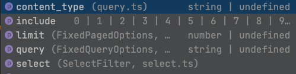

# Typescript
With version `10.0.0` we have completely rewritten the client to give the user more support on types.

## Table of contents
- [Query types](#query-types)
  - [Static query types](#static-query-keys)
  - [Dynamic query types](#dynamic-field-query-keys)
- [Response types](#response-types)
  - [withAllLocales](#withalllocales)
- [Generating type definitions](#generating-type-definitions-for-content-types)

## Query types
When querying for entries and assets, you get full type support for keys and values.
This applies to:
- `getEntry`
- `getEntries`
- `getAsset`
- `getAssets`

We have 2 levels of support:

### Static query keys


```
getEntries({
    'skip': 10,
    'limit': 20,
    'include': 5
})
```

### Dynamic (field) query keys


Dynamic query keys are based on the given shape of the expected entries content type.
To calculate dynamic keys, we have to pass-in the shape of the fields:
```typescript
type ExampleEntryFields = {
  productName: Contentful.EntryFields.Text,
  image: Contentful.Asset,
  price: Contentful.EntryFields.Number,
  categories: Contentful.Entry<CategoryEntryFields>[],
}
```

This gives us the relevant information needed, to calculate the dynamic keys and their possible value types.
```
getEntries<ExampleEntryFields>({
    'fields.price[in]': [10, 20]
})
```

## Response types
With version `10.0.0` we introduce chained clients to make better assumptions on response types. 

### withAllLocales

```typescript
import * as contentful from "contentful";

const client = contentful.createClient({
  space: "<space-id>",
  accessToken: "<content-delivery-token>",
});

const Fields = { productName: Contentful.EntryFields.Text }
const Locales = 'en-US' | 'de-DE';
const entries = client.withAllLocales.getEntry<Fields, Locales>() 
```

The returned type of `getEntry` is matching the shape
```json
{
  "fields": {
    "productName": {
      "de-DE": "<field-value>",
      "en-US": "<field-value>"
    }
  }
}
```


## Generating type definitions for content types
There are several OSS projects out there to generate type definitions for content types:

- [cf-content-types-generator](https://github.com/contentful-userland/cf-content-types-generator)
- [contentful-typescript-codegen](https://github.com/intercom/contentful-typescript-codegen)
- [contentful-ts-type-generator](https://github.com/arimkevi/contentful-ts-type-generator)
- [contentful-ts-generator](https://github.com/watermarkchurch/contentful-ts-generator)

