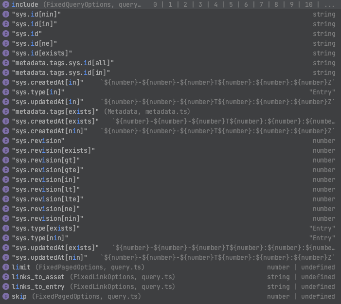

<!-- shared header  START -->

<p align="center">
  <a href="https://www.contentful.com/developers/docs/references/content-delivery-api/">
    
  </a>
</p>

<h1 align='center'>Content Delivery API</h1>

<h3 align="center">TypeScript</h3>

<p align="center">
  <a href="README.md">Readme</a> · 
  <a href="MIGRATION.md">Migration</a> · 
  <a href="ADVANCED.md">Advanced</a> · 
  <a href="TYPESCRIPT.md">TypeScript</a> · 
  <a href="CONTRIBUTING.md">Contributing</a>
</p>

<p align="center">
  <a href="https://www.contentful.com/slack/">
    
  </a>
</p>

<!-- shared header  END -->

## Introduction

<a href="LICENSE">
    
  </a>
  <a href="https://circleci.com/gh/contentful/contentful.js">
    
  </a>
 <a href="https://www.npmjs.com/package/contentful">
    
  </a>
   <a href="https://www.jsdelivr.com/package/npm/contentful">
    
  </a>
<a href="https://npm-stat.com/charts.html?package=contentful">
    
  </a>
<a href="https://unpkg.com/contentful/dist/contentful.browser.min.js">
    
  </a>

With version `10.0.0`, we have completely rewritten the client to give the user more support on types.

<details>
<summary>Table of contents</summary>
<!-- TOC -->

- [Query types](#query-types)
  - [Static query types](#static-query-keys)
  - [Dynamic query types](#dynamic-field-query-keys)
- [Response types](#response-types)
  - [withAllLocales](#withalllocales)
  - [withoutLinkResolution](#withoutlinkresolution)
  - [withoutUnresolvableLinks](#withoutunresolvablelinks)
- [Generating type definitions](#generating-type-definitions-for-content-types)

<!-- /TOC -->
</details>

## Query types

When querying for entries and assets, you get full type support for keys and values.
This applies to:

- `getEntry`
- `getEntries`
- `getAsset`
- `getAssets`
- `parseEntries`
- initial `sync` calls

We have 2 levels of support:

### Static query keys

Static query keys are not influenced by the shape of the entries or assets you're querying for.



```js
getEntries({
  skip: 10,
  limit: 20,
  include: 5,
})
```

### Dynamic (field) query keys

Dynamic query keys are based on the given shape of the expected entries' content type.


To calculate dynamic keys, we have to provide the shape of the entries:

```typescript
import * as contentful from 'contentful'

type CategoryEntrySkeleton = {
  contentTypeId: 'category'
  fields: {
    categoryName: contentful.EntryFieldTypes.Text
  }
}

type ProductEntrySkeleton = {
  contentTypeId: 'product'
  fields: {
    productName: contentful.EntryFieldTypes.Text
    image: contentful.EntryFieldTypes.AssetLink
    price: contentful.EntryFieldTypes.Number
    categories: contentful.EntryFieldTypes.Array<
      contentful.EntryFieldTypes.EntryLink<CategoryEntrySkeleton>
    >
    location: contentful.EntryFieldTypes.Location
  }
}
```

We can then pass this shape to our `getEntries` call. This gives us the relevant information needed to calculate the dynamic keys and their possible value types.

```typescript
const client = contentful.createClient({
  space: '<space-id>',
  accessToken: '<content-delivery-token>',
})

// content_type query parameter is required when filtering on any field
client.getEntries<ProductEntrySkeleton>({
  content_type: 'product',
  'fields.price[gt]': 100,
})
```

#### Limitation

- To limit the complexity of query types we use a simple type definition for [search on references](https://www.contentful.com/developers/docs/references/content-delivery-api/#/reference/search-parameters/search-on-references).
  We only check that prefix of the form `fields.reference` matches a reference field called "reference". The rest of the parameter is not evaluated and thus does not provide autocomplete functionality.

#### Breaking Change

Query types that accept an array of values used to accept them as a comma-separated string which is no longer supported.
The user must instead provide the original array.

The list of query filters that only accept arrays from now on:

- `select`
- `order`
- `[within]`
- `[near]`
- `[in]`
- `[nin]`

Example of the new usage:

```typescript
client.getEntries<ProductEntrySkeleton>({
  content_type: 'product',
  'fields.location[near]': [10, 20, 30],
})
```

## Response types

With version `10.0.0` we introduce [client chain modifiers](README.md#client-chain-modifiers) to make better assumptions on response types.
Entries can be returned in six different response shapes. Thanks to the three client modifiers below, the expected return shape can be identified, making it safer to work with the returned data.

### `withAllLocales`

If the current chain includes `withAllLocales`, `getAsset` and `getAssets` expect an optional generic parameter for all existing locales in your space. `parseEntries`, `getEntry` and `getEntries` expect an optional second generic parameter.
If the `Locale` type is provided, your response type will define all locale keys for your field values:

```typescript
import * as contentful from 'contentful'

const client = contentful.createClient({
  space: '<space-id>',
  accessToken: '<content-delivery-token>',
})

type ProductEntrySkeleton = {
  fields: { productName: contentful.EntryFieldTypes.Text }
  contentTypeId: 'product'
}
type Locales = 'en-US' | 'de-DE'
const entry = client.withAllLocales.getEntry<ProductEntrySkeleton, Locales>('some-entry-id')
```

The return type of the `getEntry` is matching the `fields` shape

```json
{
  "fields": {
    "productName": {
      "de-DE": "<field-value>",
      "en-US": "<field-value>"
    }
  }
}
```

Similar for assets:

```typescript
import * as contentful from 'contentful'

const client = contentful.createClient({
  space: '<space-id>',
  accessToken: '<content-delivery-token>',
})

type Locales = 'en-US' | 'de-DE'
const asset = client.withAllLocales.getAsset<Locales>('some-asset-id')
```

```json
{
  "fields": {
    "file": {
      "de-DE": "<field-value>",
      "en-US": "<field-value>"
    }
  }
}
```

### `withoutLinkResolution`

If the current chain includes `withoutLinkResolution`, the returned type doesn't resolve linked entities, but keeps them as link objects instead.

```typescript
import * as contentful from 'contentful'

const client = contentful.createClient({
  space: '<space-id>',
  accessToken: '<content-delivery-token>',
})

type ProductEntrySkeleton = {
  contentTypeId: 'product'
  fields: {
    productName: contentful.EntryFieldTypes.Text
    image: contentful.EntryFieldTypes.AssetLink
    price: contentful.EntryFieldTypes.Number
  }
}

type ReferencedProductEntrySkeleton = {
  fields: { relatedProduct: contentful.EntryFieldTypes.EntryLink<ProductEntrySkeleton> }
  contentTypeId: 'referencedProduct'
}
const entry = client.withoutLinkResolution.getEntry<ReferencedProductEntrySkeleton>('some-entry-id')
```

The return type of `getEntry` is matching the `fields` shape

```json
{
  "fields": {
    "productName": {
      "type": "Link",
      "linkType": "Entry",
      "id": "linkedProductId"
    }
  }
}
```

[Read more on link resolution](ADVANCED.md#link-resolution)

### `withoutUnresolvableLinks`

If the current chain includes `withoutUnresolvableLinks`, the returned type doesn't include linked entries that are not resolvable, for example if the linked entity does not exist anymore or is not yet published.

```typescript
import * as contentful from 'contentful'

const client = contentful.createClient({
  space: '<space-id>',
  accessToken: '<content-delivery-token>',
})

type ProductEntrySkeleton = {
  contentTypeId: 'product'
  fields: {
    productName: contentful.EntryFieldTypes.Text
    image: contentful.EntryFieldTypes.AssetLink
    price: contentful.EntryFieldTypes.Number
  }
}

type ReferencedProductEntrySkeleton = {
  fields: { relatedProduct: contentful.EntryFieldTypes.EntryLink<ProductEntrySkeleton> }
  contentTypeId: 'referencedProduct'
}
const entry =
  client.withoutUnresolvableLinks.getEntry<ReferencedProductEntrySkeleton>('some-entry-id')
```

The return type of `getEntry` is matching the `fields` shape

```json
{
  "fields": {}
}
```

## Generating type definitions for content types

It is recommended to define field types for all your content types. This helps the type system to infer all possible query keys/value types for you.
Doing this manually is cumbersome, but do not worry!
There are several OSS projects out there to generate type definitions for Contentful content types:

- [cf-content-types-generator](https://github.com/contentful-userland/cf-content-types-generator)
- [contentful-typescript-codegen](https://github.com/intercom/contentful-typescript-codegen)
- [contentful-ts-type-generator](https://github.com/arimkevi/contentful-ts-type-generator)
- [contentful-ts-generator](https://github.com/watermarkchurch/contentful-ts-generator)

If you prefer a GUI, you can also use an app in your Contentful space to automatically generate TypeScript definitions for your content types:

- [TS Content Types Generator App](https://github.com/marcolink/cf-content-types-generator-app)
